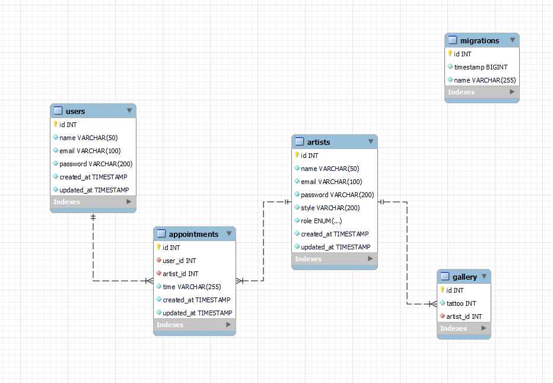

# TATTOO STUDIO BACKEND

##[Enlace al repositorio](https://github.com/PabloProst/Tattoo-Studio-backend)

## Objetivo
Este proyecto es una creación de una API y una base de datos capaces de simular un backend de un estudio de tatuajes real.

## Tecnologías utilizadas:

Mysql
Node
Nodemon
Typescript
Postman
Git


## Diagrama BD 🚀


## Instalación en local
1. Clonar el repositorio
2. ` $ npm install `
3. Conectamos nuestro repositorio con la base de datos 
4. ``` $ Ejecutamos las migraciones ``` 
5. ``` $ npm run dev ```  para poner el servidor en marcha


## Endpoints

<summary>Endpoints</summary>

    - REGISTER

            POST http://localhost:3430/register
        
            {
                "name": "pedro",
                "email": "pedro@pedro.com",
                "password": "1234A!"
            }

    - LOGIN

            POST http://localhost:3430/login  

            {
                "email": "pedro@pedro.com",
                "password": "1234A!"
            }

    - PROFILE

            POST http://localhost:3430/profile

            TOKEN + 

            {

                "email": "pedro@pedro.com",
                "password": "GeeksHubs1!"
            }

    - UPDATE USER

            POST http://localhost:3430/update

            TOKEN + 

            {

                "email": "hola@pedro.com",
                "password": "1111A!"
            }

    - GET GALLERY

            POST http://localhost:3430/gallery

    - ARTIST REGISTER (ADMIN)

            POST http://localhost3430/admin/register

    - ARTIST LOGIN 

            POST http://localhost3430/admin/login

    - GET ALL USERS (ADMIN)

            POST http://localhost:3430/admin/users

    - DELETE USER (ADMIN)

            POST http://localhost:3430/admin/delete

            {
                "id": "1"
            }

## Licencia
Este proyecto se encuentra bajo licencia de "Pablo Prost"

## Desarrollo:

``` js
 const developer = "PabloProst";

 console.log("Desarrollado por: " + PabloProst);
```  

